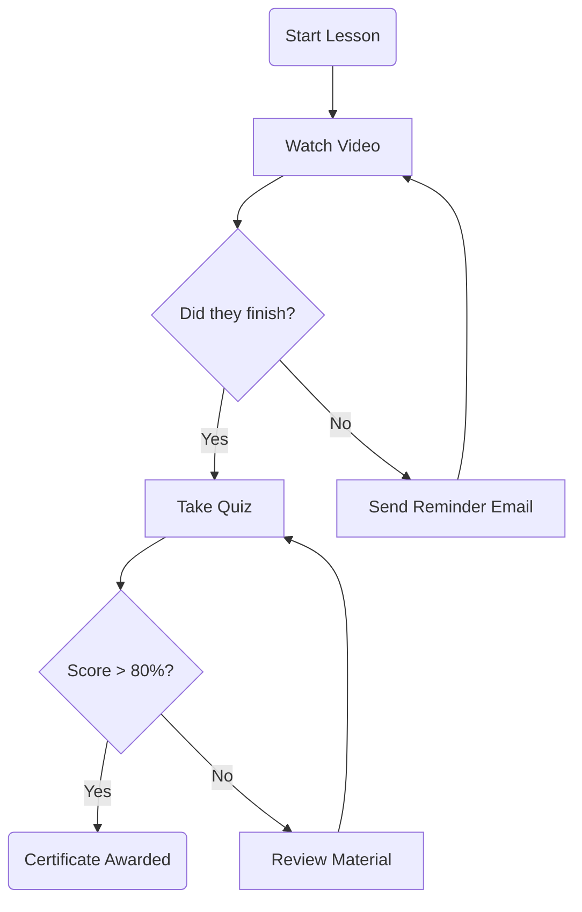

A living collection of quotes, design principles, and thoughts I encounter in my daily life.

---

> "Education is not the filling of a pail, but the lighting of a fire."
>
> — **W.B. Yeats**

---

> "Design is really an act of communication, which means having a deep understanding of the person with whom you are communicating."
>
> — **Donald A. Norman**, *The Design of Everyday Things*

---

> "We learn by doing."
>
> — **Aristotle**



### 2. "Admonitions" (Colored Callout Boxes)
In a case study, you often want to highlight a "Key Learning" or a "Failure." Chirpy has built-in colored prompts for this.

**How to do it:**
```markdown
> [!TIP]
> **Key Insight:** Users ignored the VR headset until we added a physical prompt.

> [!DANGER]
> **Mistake:** We forgot to account for color-blind users in the first prototype.